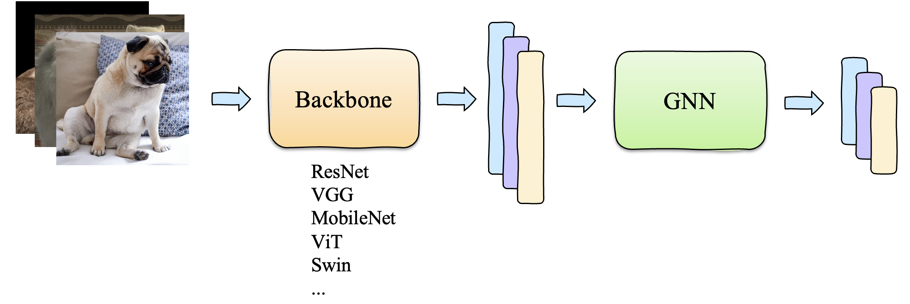

# Tutorial on Graph Convolutional Networks (Hybrid AI Project)
by Thanh-Huy Nguyen and Thi-Thu-Khiet Dang
## Introduction
Official code for Hybrid and Distributed AI project.

## Our Graph Convolutional Networks Framework on Image Datasets

## Requirements
This repository is based on PyTorch 1.8.0, CUDA 11.1, and Python 3.6.13. Experiments in our work were conducted on NVIDIA GeForce RTX 3090 GPU with an identical experimental setting.

## Questions
If you have any questions, welcome contact us at 'thanh-huy_nguyen@etu.u-bourgogne.fr' (Huy).

